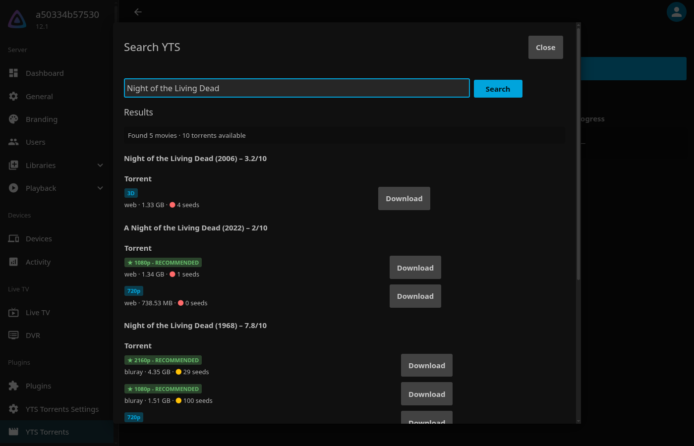

# YTS Torrents — Jellyfin Plugin

Search [YTS](https://yts.gg) for movies from inside Jellyfin's dashboard, send a chosen torrent
release to your own [qBittorrent](https://www.qbittorrent.org/) instance, and have the finished
movie imported into your Jellyfin library automatically. No embedded torrent engine: qBittorrent
does the downloading, this plugin orchestrates search → download → import.

Requires Jellyfin **12.1** and a qBittorrent instance with the WebUI enabled.



## Features

- Search YTS by title from a dashboard page and start a download with one click.
- Torrents go to qBittorrent under a dedicated category, so they never mix with your other torrents.
- Finished downloads are hardlinked (or copied/moved) into your library as `Title (Year)/`,
  subtitles included, and a library scan is triggered — no manual file moving.
- Live download progress and seeding status on the plugin's dashboard page.

## Install

1. In Jellyfin, go to **Dashboard → Plugins → Repositories** and add:
   ```
   https://raw.githubusercontent.com/guiu-rocafort/jellyfin-yts/main/manifest.json
   ```
2. Install **YTS Torrents** from the catalog and restart Jellyfin.
3. Open **YTS Torrents Settings** in the dashboard sidebar and configure it.

## Documentation

- [User manual](docs/index.md)
  - [Installation](docs/installation.md)
  - [Configuration](docs/configuration.md)
  - [Usage](docs/usage.md)
  - [Troubleshooting](docs/troubleshooting.md)
- [Development](docs/development.md) — building, testing, local dev stack, releasing

## Security notes

The plugin's API endpoints require a Jellyfin server administrator. qBittorrent credentials are
stored unencrypted in the plugin's XML config (the same as every Jellyfin plugin stores third-party
credentials), so firewall the qBittorrent WebUI port to the Jellyfin host/network only. See
[Configuration → Security](docs/configuration.md#security) for details.
