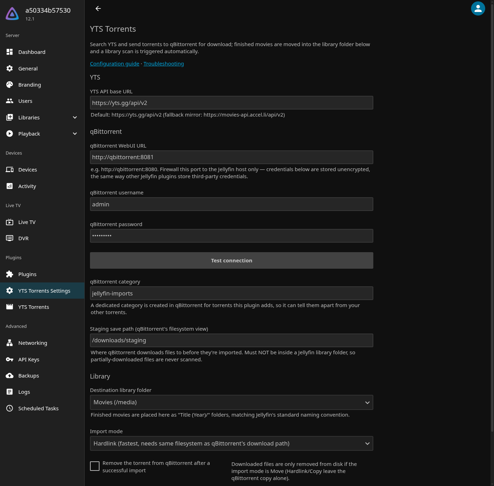

# Configuration

Open **YTS Torrents Settings** from the dashboard sidebar (or **Dashboard → Plugins → YTS Torrents
→ Settings**).



## Paths: read this first

There are three filesystems involved, and most setup problems come from mixing them up:

| Path | Seen by | Example |
|---|---|---|
| **Staging save path** | qBittorrent | `/downloads/staging` |
| **Download location as reported by qBittorrent** | Jellyfin reads it | `/downloads/staging/Sintel (2010)` |
| **Destination library folder** | Jellyfin | `/media/movies` |

Rules:

1. **Jellyfin must see qBittorrent's download folder at the same path.** When a download finishes,
   qBittorrent reports where it saved the files (e.g. `/downloads/staging/...`). The plugin runs
   inside Jellyfin and reads that exact path. If Jellyfin and qBittorrent run in separate
   containers, mount the same host folder at the same container path in both.
2. **The staging path must not be inside a Jellyfin library folder.** Otherwise Jellyfin scans
   half-downloaded files into your library.
3. **For Hardlink mode, staging and library must be on the same filesystem.** In Docker, a
   filesystem is a single volume mount, so two separate bind mounts count as different filesystems
   even if they're on the same disk. Mount a common parent (e.g. `/data` holding both
   `downloads/` and `media/`) if you want real hardlinks.

Example `docker compose` layout that satisfies all three:

```yaml
services:
  jellyfin:
    volumes:
      - /srv/data:/data          # library at /data/media/movies
  qbittorrent:
    volumes:
      - /srv/data:/data          # staging at /data/downloads/staging
```

Then set the staging save path to `/data/downloads/staging`, and add `/data/media/movies` as your
Jellyfin movies library.

## Settings reference

### YTS

| Setting | Default | Description |
|---|---|---|
| YTS API base URL | `https://yts.gg/api/v2` | YTS API endpoint. If the default is unreachable, try the mirror `https://movies-api.accel.li/api/v2`. |

### qBittorrent

| Setting | Default | Description |
|---|---|---|
| qBittorrent WebUI URL | `http://qbittorrent:8080` | Address of the qBittorrent WebUI **as seen from the Jellyfin server**. On a shared Docker network, use the service name (`http://qbittorrent:8080`), not `localhost`. |
| Username / Password | — | qBittorrent WebUI credentials. Use **Test connection** to check them before saving. |
| qBittorrent category | `jellyfin-imports` | A category the plugin creates and puts all its torrents in, so it never touches your other torrents. |
| Staging save path | — | Where qBittorrent saves downloads, **in qBittorrent's filesystem view**. See the [path rules](#paths-read-this-first). |

### Library

| Setting | Default | Description |
|---|---|---|
| Destination library folder | — | Pick from your existing Jellyfin library folders. Finished movies are placed here as `Title (Year)/`. |
| Import mode | Hardlink | How files get into the library. See below. |
| Remove the torrent from qBittorrent after a successful import | off | Removes the torrent from qBittorrent after import, which stops seeding. Downloaded files are only deleted from disk in **Move** mode. |

### Import modes

| Mode | Disk usage | Keeps seeding | Notes |
|---|---|---|---|
| **Hardlink** | No extra space | Yes | Needs staging and library on the same filesystem. If a hardlink isn't possible, the plugin automatically **falls back to a copy** and logs it. |
| **Copy** | Double | Yes | Works across filesystems. |
| **Move** | No extra space | No | qBittorrent loses the files, so the torrent will show as missing/errored in qBittorrent unless you also enable *Remove the torrent…*. |

Click **Save** when done.

## Security

- The plugin's pages and API endpoints are only available to Jellyfin **administrators**, because
  they trigger internet downloads and disk writes.
- qBittorrent credentials are stored **unencrypted** in the plugin's XML config on the Jellyfin
  server, like every other Jellyfin plugin that stores third-party credentials. Restrict access
  to the qBittorrent WebUI port to the Jellyfin host/network, and give it its own password.
- Import paths are always built on the server from YTS movie data and checked to stay inside the
  configured library folder. They are never taken from the browser.

## Next step

[Start downloading →](usage.md)
