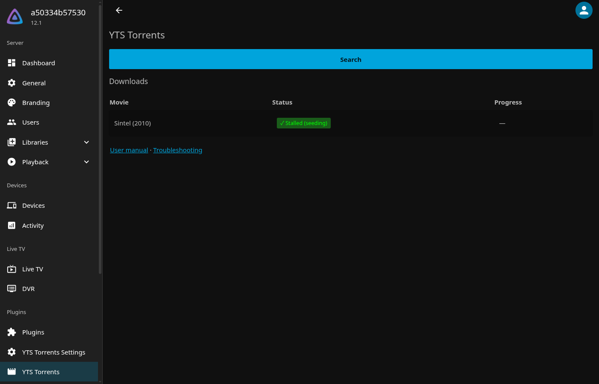
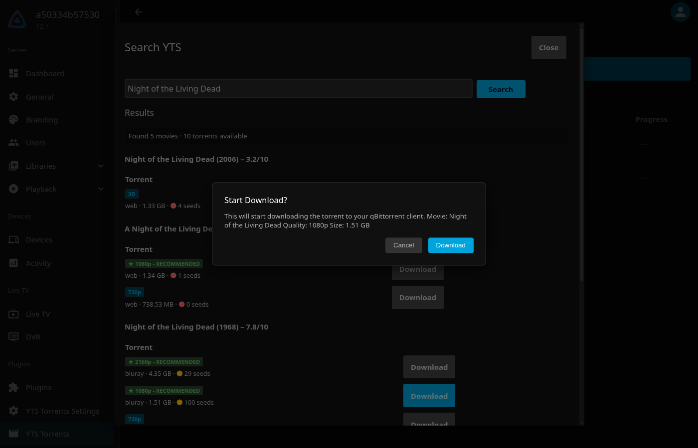
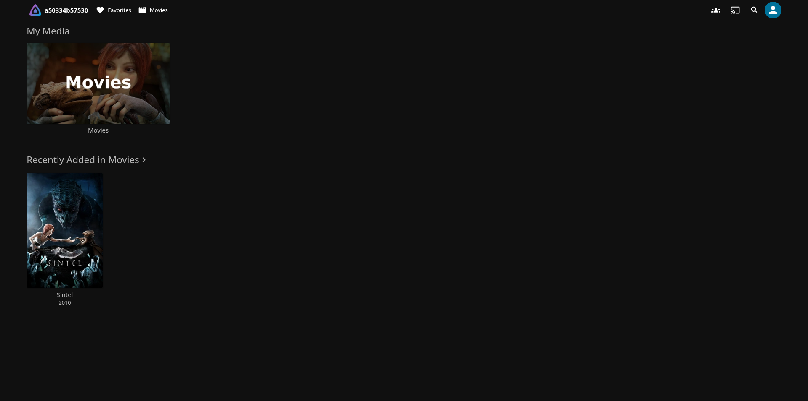

# Usage

Open **YTS Torrents** from the dashboard sidebar (under *Plugins*).



## Searching and downloading

1. Click **Search** to open the search dialog.
2. Type a movie title and press **Search**. Results show each movie with its year and rating, and
   every available release for it.
3. Each release shows its quality, type (e.g. web/bluray), size and seed health. Releases are
   sorted with the best quality and most seeds first, and 1080p+ releases are marked
   **RECOMMENDED**.

   

4. Click **Download** on a release and confirm. The release is sent to qBittorrent and appears in
   the **Downloads** list.

   

Releases you have already downloaded are marked **Downloaded** in the search results instead of
showing a Download button.

## The Downloads list

The Downloads list on the main page shows every download the plugin is tracking, newest first,
with progress, speed and estimated time remaining.

| State | Meaning |
|---|---|
| **Downloading** | qBittorrent is downloading. Progress is refreshed each time the poll task runs. |
| **Importing** | The download finished, and files are being placed into your library. If Jellyfin restarts mid-import, the import is retried automatically on the next poll. |
| **✓ Seeding / Stalled / Paused…** | Imported. The movie will appear in your library once Jellyfin's scan finishes. The badge shows qBittorrent's live seeding status and how much has been uploaded. |
| **✗ Failed — *reason*** | Something went wrong; the reason is shown next to the badge. See [Troubleshooting](troubleshooting.md#download-failed). |

## When imports happen

A scheduled task, **Poll YTS Torrent Downloads**, runs shortly after Jellyfin starts and then
every minute. It checks qBittorrent for finished downloads and imports them.

To run it right away, or change how often it runs, go to **Dashboard → Scheduled Tasks → Library →
Poll YTS Torrent Downloads**.

## What ends up in your library

For a movie *Sintel (2010)* with *Destination library folder* `/media/movies`:

```
/media/movies/
└── Sintel (2010)/
    ├── Sintel.2010.1080p.BluRay.x264.YIFY.mp4
    └── English.srt
```

Video files (`.mkv .mp4 .avi .mov .wmv .m4v .ts`) and subtitles (`.srt .sub .idx .ass .ssa .vtt`)
are imported. Other files in the torrent (sample images, `.txt`/`.nfo`) are left behind.


